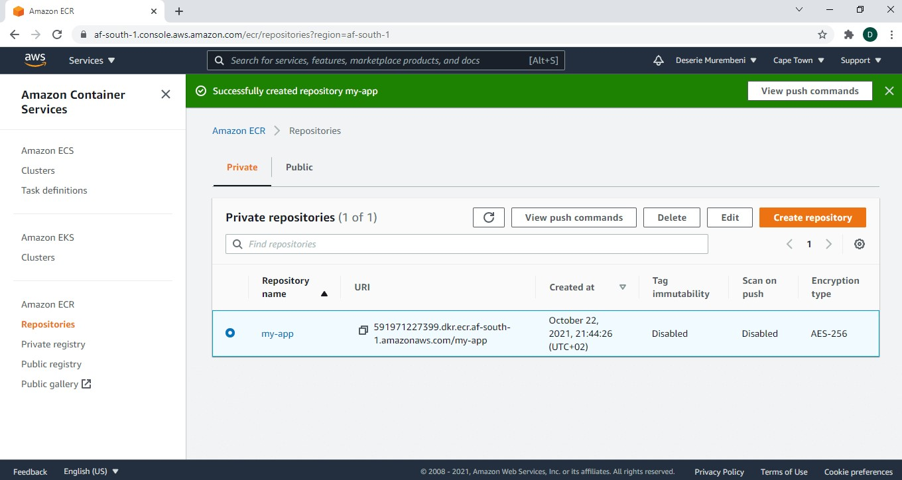

# Docker Practice Project

> Practice Makes Perfect: Another project to practice using Docker

In this challenge set in the DevOps SheCodeAfrica slack channel, I will be following along with [TechWorld with Nana Docker Tutorial](https://youtu.be/3c-iBn73dDE)

**Demo Project**

Stack:

Frontend: HTML. CSS, JS
Backend: Node.js
Database: MongoDB


<details>
<summary><b>Pre-Requisites</b></summary><p>
Download and install Docker. I am on a Windows machine running Windows home. I used the following guide to help me: [Windows Subsystem for Linux Installation Guide for Windows 10](https://docs.microsoft.com/en-us/windows/wsl/install-win10). Once I had done that I was able to download [Docker Desktop for Windows](https://docs.docker.com/desktop/windows/install/#system-requirements-for-wsl-2-backend).

</p></details>

<details>
<summary><b>Container vs Image</b></summary><p>

- A container is the running environment for an image.

- You can have multiple containers running on your machine

- An image is made up of different layers

- Images have tags/versions. If you don't specify a version you get the latest version.

- All the artifacts on DockerHub are images.

</p></details>

<details>
<summary><b>Basic Commands</b></summary><p>

**docker pull** pulls image from repo to your machine

**docker ps** list running containers

**docker run** starts a new container from an image

**docker run -d** start container in detached mode, meaning output will be container ID, then container will stop running

**docker stop** stops container

**docker start** starts stopped container

**docker ps -a** lists running and stopped containers

**docker logs** get logs to help debug your container

**docker exec** runs a new command in a running container/ launch a Bash terminal within a container

[OFFICIAL DOCKER COMMANDS CHEATSHEET](https://docs.docker.com/engine/reference/commandline/docker/)

</p></details>

<details>
<summary><b>Create Network and Setup MongoDB</b></summary><p>

# commands

## create docker network

```
  docker network create mongo-network
```

## start mongodb

```
  docker run -d -p 27017:27017 -e MONGO_INITDB_ROOT_USERNAME=admin -e MONGO_INITDB_ROOT_PASSWORD=password --name mongodb --net mongo-network mongo
```

## start mongo-express

```
  docker run -d -p 8081:8081 -e ME_CONFIG_MONGODB_ADMINUSERNAME=admin -e ME_CONFIG_MONGODB_ADMINPASSWORD=password --net mongo-network --name mongo-express mongo-express
```

</p></details>

<details>
<summary><b>Docker Compose</b></summary><p>

# Start containers using docker compose

Create docker compose file. (see mongo-docker-compose.yaml)

Run the following command to start all the containers defined in the docker compose file:

```
  docker-compose -f mongo-docker-compose.yaml up
```

To stop the containers run:

```
  docker-compose -f mongo-docker-compose.yaml down
```

</p></details>

<details>
<summary><b>Dockerfile</b></summary><p>

**A Dockerfile is a blueprint for building images.**

## ANATOMY OF A DOCKERFILE

_FROM_ start by basing it on another image

Ours is a JavaScript app with Node backend so we will use Node inside our container.

```
 FROM node
```

We can configure environmental variables. This step is optional. It is better to define environmental variables in the docker-compose file though: they are easier to manage that way

```
  ENV MONGO_DB_USERNAME=admin
      MONGO_DBPWD=password
```

Can execute any Linux command. The following command creates a /home/app folder INSIDE the container.

```
  RUN mkdir -p /home/app
```

Copy current folder files to /home/app. The . refers to the current folder.

```
  COPY . /home/app
```

Start the app with the following command:

```
  CMD ["node" "server.js"]
```

**What is the difference between RUN and CMD?**

CMD is an entrypoint command and you can only have one CMD command per Dockerfile.

You can have multiple RUN commands.

To build an image using a Dockerfile, you have to give the image name and tag using "-t". You must also provide the location of the Dockerfile. In this case we're in the the same folder as the Dockerfile so the location is defined by a .

```
  docker build -t my-app:1.0 .
```

To make sure the image has been created run

```
  docker images
```

Whenever you change the Dockerfile, you have to rebuild the image.

To start the container based on the image we just built, run:

```
  docker run my-app:1.0
```


</p></details>

<details>
<summary><b>Private Container Registry</b></summary><p>

1. Create private Docker repository on AWS - in the AWS console search for ECR (Elastic Container Registry), and click _Get Started_ . Under _Create Repository_ for the repo name, enter a name that is the same as your image. Click _Create Repository_. Each image should have it's own repo.




2. Push our image that we have created locally to ECR - inside the ECR dashboard, select the image, and click on _View Push Commands._ You always have to login to the private repo using

```
  docker login
```

AWS provides the docker login command, just copy and paste into your terminal. In order for this to work you need to have the AWS cli installed and credentials configured.


</p></details>
